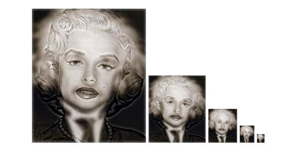

# 胡展維(Chan-wei Hu) (102061247)

# Project 1 / Image Filtering and Hybrid Images

## Overview
The project is related to 
> Image filtering, 2D-convolution

## Implementation
1. Implement my own filtering function in my_imfilter.m

Pseudo code:
    
    rotate the kernel for 180 degree
    for i = 1:channels
        Zero-padding for each channel on image
    end
    
    for row = 1:image_row
        for col = 1:image_col
	    do 2D-convolution algorithm
        end
    end
   
2. Hybrid Image implementation
    * use Guassian filter to make a low-pass filter and then filter image1.
    * simply take (1 - low-pass filter) to get a high-pass filter, and then filter image2.
    * Combine these two filtered images.

## Installation
* Only require Matlab
* How to compile from source?
	* Step 1: git clone the code to user local
	* Step 2: run proj1.m and get the hybrid image!

## My Hybrid Image Results

<table border=1>

<tr>
<td align="center">
<b> High frequency component</b>
</td>
<td align="center">
<b> Low frequency component<b/>
</td>
<td align="center">
<b> Hybrid image<b/>
</td>
</tr>

<tr>
<td>
</td>
<td>
</td>
<td>

</td>
</tr>

<tr>
<td>
</td>
<td>
</td>
<td>

</td>
</tr>

<tr>
<td>
</td>
<td>
</td>
<td>

</td>
</tr>

<tr>
<td>
</td>
<td>
</td>
<td>

</td>
</tr>

</table>
