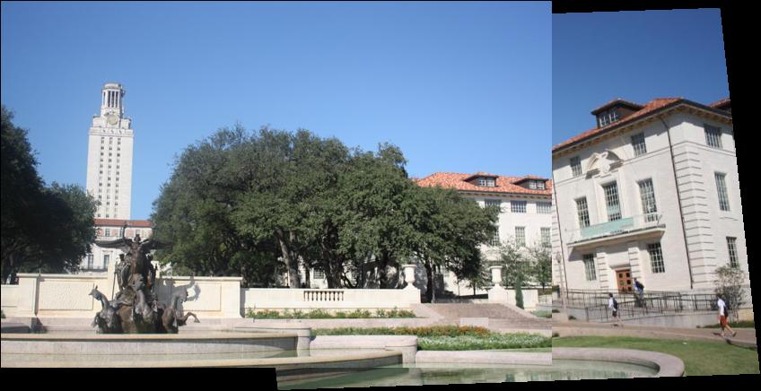
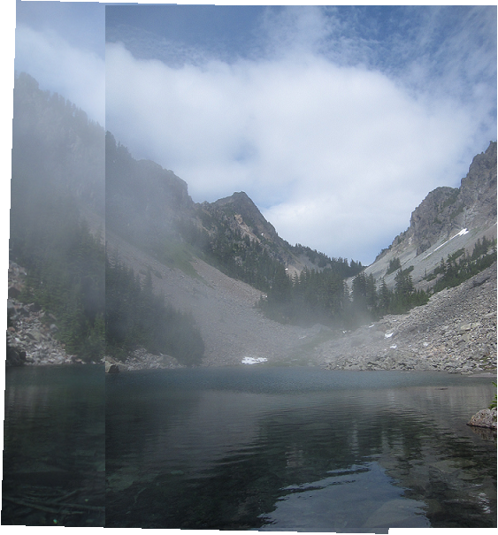
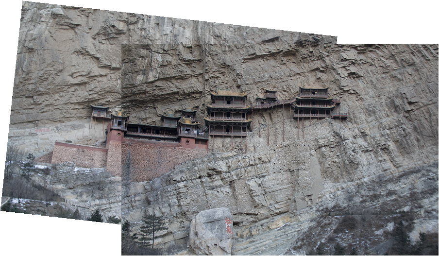
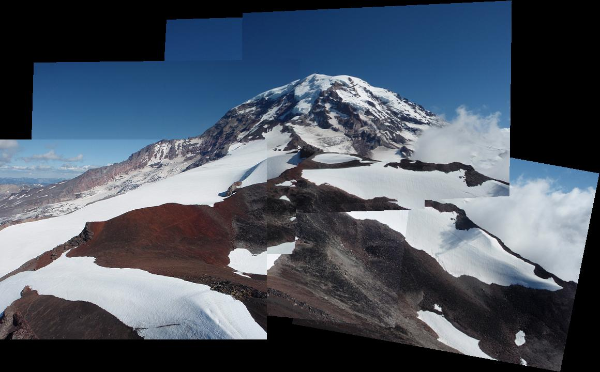
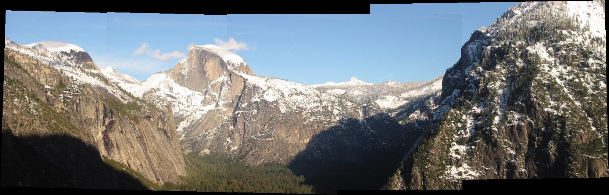
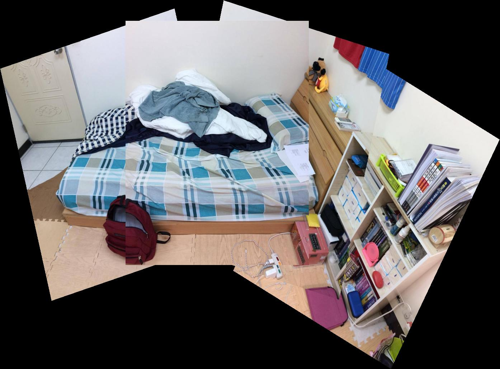

# Chan-Wei Hu(胡展維) (102061247)

# Project 2 / Panorama Stitching

## Overview
The project is related to Image stitching
> Image stitching or photo stitching is the process of combining multiple photographic images with overlapping fields of view to produce a segmented panorama or high-resolution image.

## Implementation
1. Overview
	* Step 1: Detect keypoints(Using SIFT).
	* Step 2: Match keypoints(Which means most similar features, compared to 2nd most similar).
	* Step 3: Use RANSAC to give a more robust estimate of affine transformation matrix.
	* Step 4: Given that transformation matrix, use it to transform (shift, scale, or skew) image 1 and overlay it on top of image 2.
	* Step 5: Done!
	
2. Implementation Details
    * First, we will use the function `vl_sift` in VLFeat Matlab to find the image descriptor, just simply use it! As following:
	
            [f, descriptor] = vl_sift(Image);

    * Then we match one set of SIFT descriptors (descriptor1) to another set of descriptors (decriptor2). Using Euclidean distance as following:
	
	    

          And my implementation is as following code:
	  	      
              N1 = size(descriptor1, 1);
              N2 = size(descriptor2, 1);
              col = size(descriptor1, 2);

              if((size(descriptor1, 2) == size(descriptor2, 2)) && (col ~= 128))
                  error('Column input is not 128');
                  return;
              end
    
              for i = 1 : N1 
                  Descriptor1_rep = repmat(descriptor1(i,:), N2, 1);
                  distance = sqrt(sum((Descriptor1_rep - descriptor2).^2, 2)); % Euclidean distance
                  min_distance = min(distance);
                  [index]=find(distance == min_distance);
                  distance(index)=[];
                  min_distance_2 = min(distance);
    
                  if(min_distance < thresh * min_distance_2)
                      match=[match; [i index]];
                  end
              end
              
    * Now we get a list of matched keypoints across the two images in `SIFTSimpleMatcher.m`, and we need to find a transformation matrix that maps an image 1 point to the corresponding coordinates in image 2	in next step. Means that we need to solve H*P1=P2, my implementation is as following(in `ComputeAffineMatrix.m`):
    
              H = (P1'\P2')';
	      
    * After above steps, rather than directly feeding all of our SIFT keypoint matches into `ComputeAffineMatrix.m`, we will use RANSAC to select only “inliers” to use to compute the transformation matrix. RANSAC has been done by TAs, so we just need to compute the error using transformation matrix H to transform the point in pt1 to its matching point in pt2. My implementation is as following:
              
              dists = zeros(size(match,1),1);

              for i = 1: size(match,1) 
                  P1 = [pt1(match(i,1),:) 1]';
                  P1_ = (H * P1)';
                  pt1_ = P1_(1:2);
                  dists(i) = sqrt(sum((pt1_ - pt2(match(i,2),:)).^2));
              end
	
    * After we finish above, we can run `TransformationTester.m` to stitch two related images! Refer to 'My Result ---> Stitch two images!
    
    * Finally, I worked on stitching multiple images which is stitching in ordered sequence(IMPORTANT! MUST be ordered). I choose a reference image, and then use Affine transform to transform each coordinate to reference coordinate. My code is as following:
     
              T=eye(3);  
              if(currentFrameIndex<refFrameIndex)
                  for i=currentFrameIndex:refFrameIndex-1
                      T=i_To_iPlusOne_Transform{i}*T;
                  end
              else
                  for i=currentFrameIndex-1:-1:refFrameIndex
                      T=pinv(i_To_iPlusOne_Transform{i})*T;
                  end
              end 
    
## Installation
* Required MatLab R2015a or later.
* Download [VLFeat 0.9.17 binary package](http://www.vlfeat.org/download.html), which will need in this project to detect keypoints.

### My Result

* Stitching two images(images = 2): 

<table border=1>
<tr>
<td>

</td>
</tr>

<tr>
<td>

</td>
</tr>

<tr>
<td>

</td>
</tr>
</table>

* Stitching multiple images(images > 2): 

<table border=1>
<tr>
<td>

</td>
</tr>

<tr>
<td>

</td>
</tr>

<tr>
<td>

</td>
</tr>
</table>
