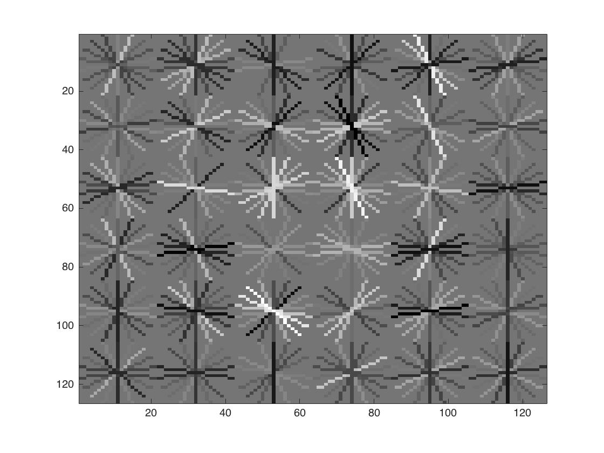

# 胡展維 (102061247)

#Project 4 / Face Detection with a Sliding Window

## Overview
The project is related to 
> In this project, we use Histogram of Gradients(HoG) descriptor, and train a linear classifier (a HoG template).We will use the classifier to classify millions of sliding windows at multiple scales.

## Implementation
1. First, we will load cropped positive trained examples (faces) and convert them to HoG features. I just simply load in the image, and use function `vl_hog` to find its HoG features. As following code in `get_positive_features.m`:

        D = (feature_params.template_size / feature_params.hog_cell_size)^2 * 31;
        feature_pos = zeros(num_images, D);
	
        for i = 1:num_images
            img = im2single(imread(strcat(train_path_pos, '/', image_files(i).name)));
            features_pos(i ,:) = reshape(vl_hog(img, feature_params.hog_cell_size), 1, D);
        end
	
2. Then, we will sample random negative examples from scenes which contain no faces and convert them to HoG features. Same as in `get_positive_features.m`. The method I sample random negative examples at multiple scales is to random choose the cropped image in a image, and find HoG features in this cropped image. As following code in `get_random_negative_features.m`:

        D = (feature_params.template_size / feature_params.hog_cell_size)^2 * 31;
        neg_sample_each_img = ceil(num_samples / num_images);
        features_neg = zeros(num_images, D);    
        for i = 1:num_images
            img = im2single(rgb2gray(imread(strcat(non_face_scn_path, '/', image_files(i).name))));
            [height, width] = size(img);
            for j = 1:neg_sample_each_img
                top_left_x = ceil(rand() * (width - feature_params.template_size));
                top_left_y = ceil(rand() * (height - feature_params.template_size));
                index = (i-1) * neg_sample_each_img + j;
                cropped = img(top_left_y:top_left_y + feature_params.template_size-1, top_left_x:top_left_x + feature_params.template_size-1);
                features_neg(index, :) = reshape(vl_hog(cropped, feature_params.hog_cell_size), 1, D);
            end
        end
	
3. Then, I train a linear classifier from the positive and negative examples, by using function `vl_trainsvm`. Fisrt, I give positive and negative features as data, and give positive feature as label 1, negative feature as label -1. As following code in `proj4.m`:

        lambda = 1e-05;
        data  = [features_pos; features_neg];
        label  = [ones(size(features_pos,1),1); -1*ones(size(features_neg,1),1)];
        [w b] = vl_svmtrain(data', label, lambda);

4. Finally, we run our sliding window on test image. We need to convert each test image to HoG feature space with a single call to vl_hog for each scale. Then step over the HoG cells, taking groups of cells that are the same size as your learned template, and classifying them. If the classification is above some confidence(I take 0.9), keep the detection and then pass all the detections for an image to non-maximum suppression. Just as my following code:

        bboxes = zeros(0,4);
        confidences = zeros(0,1);
        image_ids = cell(0,1);
        scales = [1, 0.9, 0.8, 0.7, 0.6, 0.5, 0.4, 0.3, 0.2, 0.1, 0.05];

        for i = 1:length(test_scenes)     
            fprintf('Detecting faces in %s\n', test_scenes(i).name)
            img = imread( fullfile( test_scn_path, test_scenes(i).name ));
            img = single(img)/255;
            if(size(img,3) > 1)
                img = rgb2gray(img);
            end
    
            cur_bboxes = zeros(0,4);
            cur_confidences = zeros(0,1);
            cur_image_ids = cell(0,1);
    
            for scale = scales
                img_scaled = imresize(img, scale);
                [height, width] = size(img_scaled);

                test_features = vl_hog(img_scaled, feature_params.hog_cell_size);       
                cell_num_in_img_x = floor(width / feature_params.hog_cell_size);
                cell_num_in_img_y = floor(height / feature_params.hog_cell_size);

                num_window_x = cell_num_in_img_x - feature_params.template_size / feature_params.hog_cell_size + 1;
                num_window_y = cell_num_in_img_y - feature_params.template_size / feature_params.hog_cell_size + 1;
        
                D = (feature_params.template_size / feature_params.hog_cell_size)^2*31;
                window_feats = zeros(num_window_x * num_window_y, D);
                for x = 1:num_window_x
                    for y = 1:num_window_y
                        window_feats((x-1) * num_window_y + y,:) = ...
                        reshape(test_features(y:(y + feature_params.template_size / feature_params.hog_cell_size - 1), x:(x + feature_params.template_size / feature_params.hog_cell_size - 1),:), 1, D);
                    end
                end
                scores = window_feats * w + b;
                % weight and bias from our SVM classifier, find out its scores
                indices = find(scores>0.9);
                curscale_confidences = scores(indices);

                detected_x = floor(indices./num_window_y);
                detected_y = mod(indices, num_window_y)-1;
                curscale_bboxes = [feature_params.hog_cell_size * detected_x + 1, feature_params.hog_cell_size * detected_y + 1, feature_params.hog_cell_size * (detected_x + feature_params.template_size / feature_params.hog_cell_size), feature_params.hog_cell_size * (detected_y + feature_params.template_size / feature_params.hog_cell_size)]./scale;
                curscale_image_ids = repmat({test_scenes(i).name}, size(indices,1), 1);
        
                cur_bboxes = [cur_bboxes; curscale_bboxes];
                cur_confidences = [cur_confidences; curscale_confidences];
                cur_image_ids = [cur_image_ids; curscale_image_ids];
        end

5. The histogram of oriented gradients (HOG) is a feature descriptor used in computer vision and image processing for the purpose of object detection. **I also implement my own HoG estimation (I take CellSize = 6 and BlockSize = 2 for example)**, but I just get the feature without visualize it. The flow diagram and the code(refer to [here](https://github.com/huchanwei123/homework4/blob/master/code/My_HoG.m)) of finding HoG description is as following:

If we set the smaller cell size, then it will contain more information of the image. Just as the comparison result above. The drawback is that the computation time will be longer when we take a smaller cell size.

## Installation
* Only require Matlab
* How to compile from source?
    * Step 1: git clone the code to user local
    * Step 2: run proj4.m!

## Some Typical Results

* First, I'll show some of my detection results. Green box is my detection, yellow box is ground truth, and red box is bad detection result.

<table border=1>
<tr>
<td>

</td>
</tr>

<tr>
<td>

</td>
</tr>

</table>

* Face template HoG visualization for the starter code. When we didn't modify the code, it is completely random. After I modified it by training a SVM classifier, the face template HoG visualization actually looks like a face. I also compare the cell size of 6, 4, and 2, the smaller cell size, the face template HoG visualization will approximate to a face! As following:

<table border=1>
<tr>
<td align="center">
Cell size = 6
</td>
<td align="center">
Cell size = 4
</td>
<td align="center">
Cell size = 2
</td>
</tr>

<tr>
<td>

</td>
<td>

</td>
<td>

</td>
</tr>
</table>

* Precision Recall curve for the starter code.

* Example of detection on the test set from the starter code. I have tested on extra_test_data, which contains 4 color images, and I got the following results:

